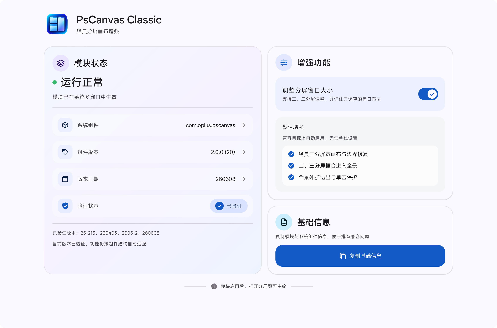

# PsCanvas Classic

**面向 ColorOS 平板 PsCanvas 的经典二、三分屏、全景交互与布局记忆增强模块**

[查看 Release](https://github.com/duoxini/pscanvasfix/releases) · [问题反馈](https://github.com/duoxini/pscanvasfix/issues)

## 功能

- 恢复经典三分屏宽画布，并同步画布槽位、任务启动边界与实际窗口边界；
- 支持二、三分屏多指捏合进入全景、外扩退出与全景单击保护；
- 支持拖动二、三分屏分隔条调整相邻窗口大小；
- 保存分屏组合时记忆窗口比例，再次保存同一组合可更新布局；
- 通过目标组件结构与能力检测适配，不以固定版本号或 APK 哈希作为启用门槛；
- 提供 Material 3 管理页，用于查看模块状态、兼容性与基础诊断信息。

## 使用要求

| 项目 | 要求 |
|---|---|
| 设备 | ColorOS 平板，且系统包含 PsCanvas 多窗口组件 |
| Android | Android 13 或更高版本（APK 最低要求） |
| 框架 | 支持现代 libxposed API 的 LSPosed 环境 |
| 目标组件 / 作用域 | `com.oplus.pscanvas` |

兼容性以结构与能力检测结果为准。目前已在四个目标组件构建上完成验证；未列出的构建仍会自动检测，请以管理页显示的运行与验证状态为准。

## 安装

以下步骤仅适用于已经取得本项目明确书面授权的用户：

1. 从 [Releases](https://github.com/duoxini/pscanvasfix/releases) 下载 APK；
2. 安装或覆盖安装 `PsCanvas Classic`；
3. 在 LSPosed 中启用模块，作用域选择 `com.oplus.pscanvas`；
4. 模块启用后，打开系统分屏即可生效。

> GitHub 自动生成的 `Source code.zip` 与 `Source code.tar.gz` 是源码归档，不是安装包。

## 问题反馈

如果系统更新后功能异常，请通过 [Issue](https://github.com/duoxini/pscanvasfix/issues/new/choose) 提供设备型号、ColorOS 与 Android 版本、LSPosed 与模块版本、复现步骤、相关日志及截图。目标组件版本信息可从模块管理页的“基础信息”中复制。

## 许可证

本项目公开源码仅允许在线查看，以及在 GitHub Fork 网络内创建并同步公开、未修改的原生 Fork。未经事先明确书面授权，不授予修改、编译、运行、发布、再分发、集成或创作衍生作品的权利。

完整条款见 [PsCanvas Classic Source-Available License](LICENSE)。针对特定 Release 二进制文件的额外授权，仅以对应发布页的明确文字为准。
