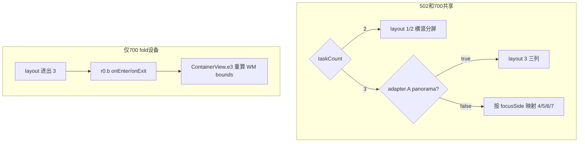
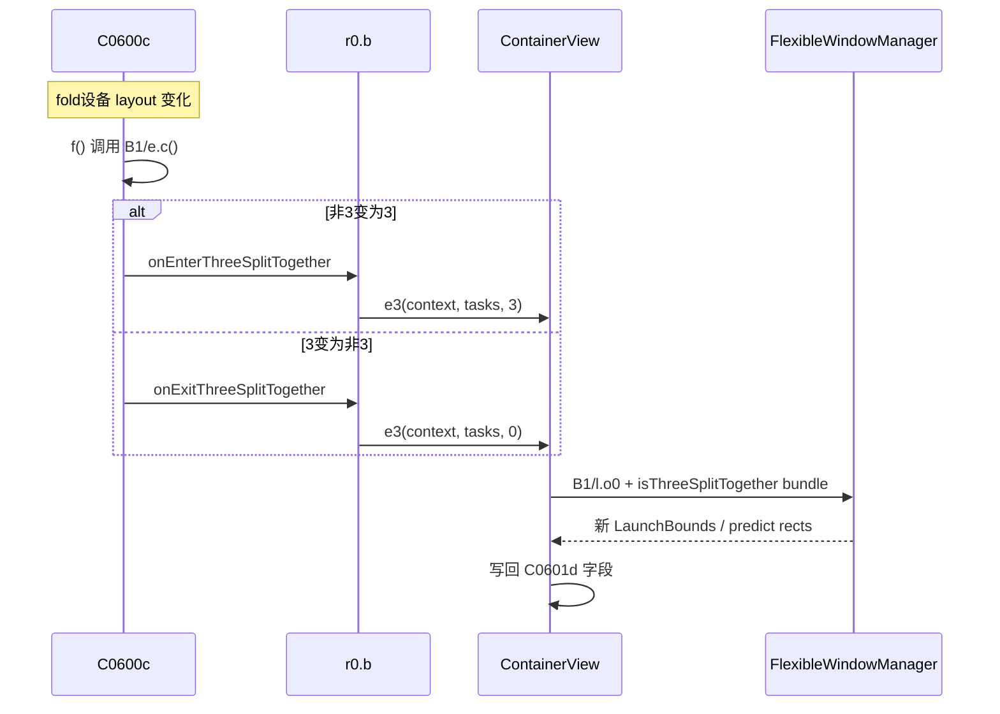
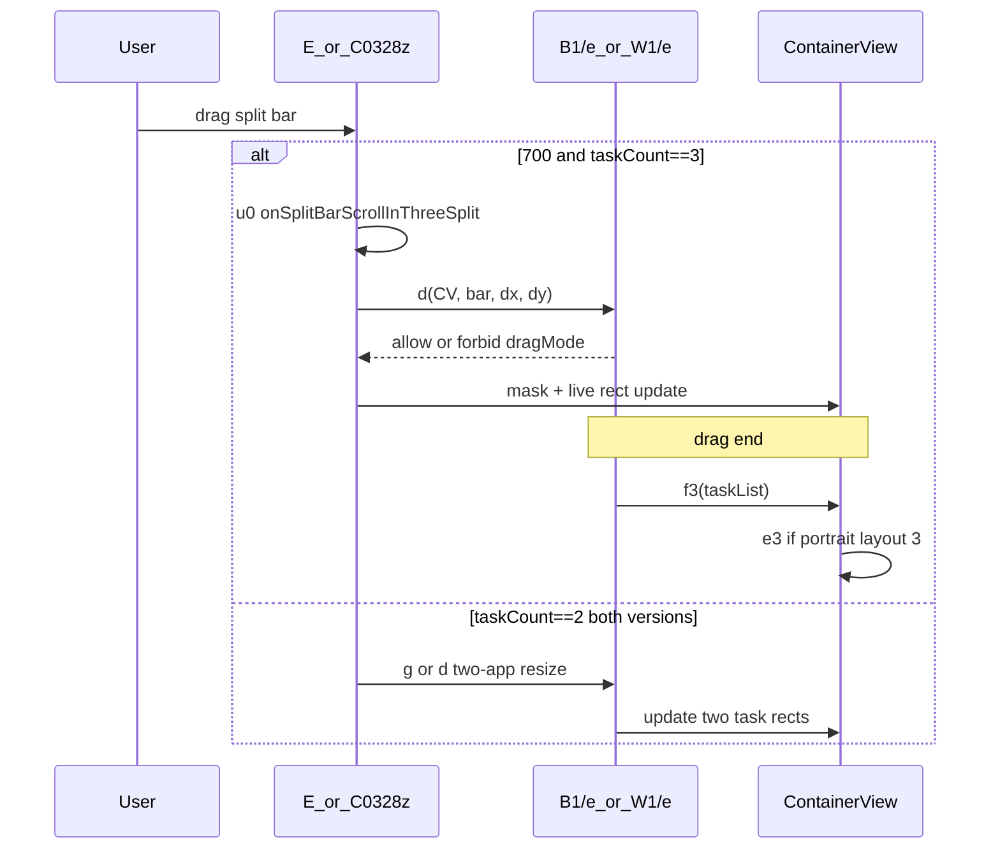

# 502 vs 700 分屏逻辑差异分析

> **范围说明**：本文仅对比 `502/decompiled` 与 `700/decompiled` 反编译源码中的分屏（flexible split / canvas split）逻辑，**不涉及** pscanvasfix Xposed hooks、捏合转浮窗（S1.p / X1.r）、控制栏「新建窗口」等。

**版本**：两版 APK 均为 `versionName=2.0.0`，502 `versionDate=251215`，700 `versionDate=260403`。

---

## 核心类映射

| 职责 | 502 | 700 |
|------|-----|-----|
| ContainerController | `com.oplus.pscanvas.canvasmode.canvas.l0` | `com.oplus.pscanvas.canvasmode.canvas.r0` |
| Adapter | `P1.C0532c` | `U1.C0600c` |
| TaskData | `P1.C0533d` | `U1.C0601d` |
| FlexibleUtil | `W1.l` | `B1.l` |
| LayoutPolicy（DefaultPolicy） | `W1.e` | `B1.e` |
| Policy 工厂 | `W1.n` | `B1.n` |
| SplitBarManager | `C0328z` | `E` |
| ContainerView | `...view.ContainerView` | `...view.ContainerView` |
| 手势管理 | `C0325w` | `C0332y` |
| 动画/还原 | `C0306c` | `C0309c` |

---

## 1. 布局方向（layoutOrientation）状态机

### 1.1 字段与读取

- 502：`C0532c.f13091b`，对外 `n()` 返回当前 layoutOrientation
- 700：`C0600c.f13788f`，对外 `n()` 返回当前 layoutOrientation

### 1.2 layoutOrientation 取值（3 应用场景）

| 值 | 含义 |
|----|------|
| 1 / 2 | 两应用横/竖分屏 |
| 3 | 标准三列均分 |
| 4 | Panorama 2+1 peek（主窗 + 两小窗横滑） |
| 5 / 6 / 7 | 2+1 变体（focus 侧在上下/左右不同） |

### 1.3 决策入口：`e.c(adapter, oldLayout, focusSide, screenChanged)`

502 `W1/e.c` 与 700 `B1/e.c` **字节码结构相同**（两方法均 decompile 失败，但 smali/字节码逐条对照一致）：

1. **2 应用**：若 oldLayout 已是 1 或 2 则保持；否则按 focus 任务 `I()`/`B()` 决定 1 或 2
2. **3 应用**：若 `adapter.A()`（panorama 标志）为 true → 保持 **3**；否则按 `adapter.d()[0]`（focusSide）与 oldLayout 映射到 **4/5/6/7**

Adapter 在 orientation 变化时调用 policy：

```358:360:502/decompiled/sources/P1/C0532c.java
    public void f(boolean z3) {
        this.f13091b = n.a().b(getContext()).c(this, this.f13091b, this.f13102m, z3);
    }
```

700 在相同 policy 调用之外，fold 设备上增加了 ThreeSplitTogether 回调（见第 2 节）：

```365:375:700/decompiled/sources/U1/C0600c.java
    public void f(boolean z3) {
        int c3 = n.a().b(getContext()).c(this, this.f13788f, this.f13799q, z3);
        if (c3 != this.f13788f && s.H()) {
            if (c3 == 3) {
                this.f13801s.a(l());
            } else if (this.f13788f == 3) {
                this.f13801s.b(l());
            }
        }
        this.f13788f = c3;
    }
```

### 1.4 Panorama 矩形算法 — 两版相同

layout 4/5/6/7 的 union rect 计算在 502 `W1/l.D()` 与 700 `B1/l.F()` 中逻辑一致（以 layout 4 为例）：

```315:322:502/decompiled/sources/W1/l.java
        if (i3 == 4) {
            if (c0533d.l().height() == c0533d2.l().height()) {
                rect.right = c0533d.l().width() + c0533d2.l().width() + ((int) (f3 * 10.0f));
            } else {
                float max = Math.max(c0533d.l().height(), c0533d2.l().height()) * 1.0f;
                rect.right = (int) ((c0533d.l().width() * (max / c0533d.l().height())) + (c0533d2.l().width() * (max / c0533d2.l().height())) + ((int) (f3 * 10.0f)));
            }
            rect.bottom = (int) (((rect.width() * 1.0f) / l3.width()) * l3.height());
```

```474:481:700/decompiled/sources/B1/l.java
        if (i3 == 4) {
            if (c0601d.n().height() == c0601d2.n().height()) {
                rect.right = c0601d.n().width() + c0601d2.n().width() + ((int) (f3 * 10.0f));
            } else {
                float max = Math.max(c0601d.n().height(), c0601d2.n().height()) * 1.0f;
                rect.right = (int) ((c0601d.n().width() * (max / c0601d.n().height())) + (c0601d2.n().width() * (max / c0601d2.n().height())) + ((int) (f3 * 10.0f)));
            }
            rect.bottom = (int) (((rect.width() * 1.0f) / n3.width()) * n3.height());
```

### 1.5 布局状态机（共享 + 700 扩展）



---

## 2. ThreeSplitTogether — 700 独有

502 **不存在**以下符号/路径：`isThreeSplitTogether`、`ContainerView.e3()`、`r0.b` 回调、`B1/l.o0()` 中的 Together bundle。

### 2.1 注册回调

700 在初始化 Controller 时把 `r0.b` 传入 Adapter：

```166:174:700/decompiled/sources/com/oplus/pscanvas/canvasmode/canvas/r0.java
    public void E(Context context, ContainerView containerView) {
        if (containerView != null) {
            this.f10610a = containerView;
            this.f10612c = new a(context);
            C0600c c0600c = new C0600c(context, 0, new ArrayList(), this.f10612c);
            this.f10611b = c0600c;
            ...
            this.f10610a.setAdapter(c0600c);
```

回调实现：

```49:59:700/decompiled/sources/com/oplus/pscanvas/canvasmode/canvas/r0.java
        public void a(List list) {
            Log.d(r0.f10608f, "onEnterThreeSplitTogether");
            r0.this.f10610a.e3(this.f10615a, list, 3);
        }
        ...
        public void b(List list) {
            Log.d(r0.f10608f, "onExitThreeSplitTogether");
            r0.this.f10610a.e3(this.f10615a, list, 0);
        }
```

### 2.2 WM bounds 重算：`ContainerView.e3` → `B1/l.o0`

`e3` 收集 Intent，调用 `o0` 向 FlexibleWindowManager 请求新 bounds，并写回 TaskData 的 panorama / predict 字段：

```3149:3182:700/decompiled/sources/com/oplus/pscanvas/canvasmode/canvas/view/ContainerView.java
    public void e3(Context context, List list, int i3) {
        ...
        List o02 = B1.l.o0(context, arrayList, i3);
        for (int i4 = 0; i4 < list.size(); i4++) {
            ...
            c0601d2.f13804C.set(c0601d3.f13804C);
            ...
            c0601d2.f13805D = c0601d3.f13805D;
            c0601d2.f13806E = c0601d3.f13806E;
            c0601d2.f13807F = c0601d3.f13807F;
            ...
        }
    }
```

`o0` 在 layout=3 且大屏 portrait 时设置 `isThreeSplitTogether`：

```2056:2062:700/decompiled/sources/B1/l.java
        if (i3 == 3 && s.I(context) && context.getResources().getDisplayMetrics().widthPixels >= 2176) {
            bundle = new Bundle();
            bundle.putBoolean("isThreeSplitTogether", true);
        } else {
            bundle = null;
        }
        Bundle n3 = n(list, i3, bundle);
```

### 2.3 辅助入口 `ContainerView.f3`

 portrait 三应用且 layout 涉及 3 时，在动画/拖拽结束前同步 layout：

```3248:3254:700/decompiled/sources/com/oplus/pscanvas/canvasmode/canvas/view/ContainerView.java
    public void f3(List list) {
        int q3 = this.f10722B.q();
        int t3 = B1.l.t(list, this.f10766f.t(), q3);
        boolean z3 = q3 == 3 || t3 == 3;
        if (B1.s.I(((ListView) this).mContext) && this.f10722B.k() == 3 && z3 && this.f10766f.t() == 2) {
            e3(((ListView) this).mContext, list, t3);
        }
    }
```

调用方包括：`C0309c`（放大/缩小动画）、`B1/e.endScrollSplitBarInThreeSplit`、`EmbeddedViewDecor`。

### 2.4 502 等价路径

502 三分屏重排仅走 `l0.N()` → `adapter.R()` → `T(false, false)`，**不向 WM 发送** `isThreeSplitTogether`：

```219:227:502/decompiled/sources/com/oplus/pscanvas/canvasmode/canvas/l0.java
    public void N() {
        ...
        } else {
            this.f10712b.R();
        }
    }
```

700 对应 `r0.O(z3)` → `T(false, false, z3)`，第三个参数为 panorama 标志。

### 2.5 ThreeSplitTogether 生命周期



---

## 3. SplitBar 拖拽 — 最大行为差异

### 3.1 路由对比

**502** `C0328z.W()`（onSplitBarScroll）只处理 **2 应用**：guard 与 drag 分支均检查 `containerController.i() == 2`，**无** taskCount==3 分支。

```1040:1052:502/decompiled/sources/com/oplus/pscanvas/canvasmode/canvas/C0328z.java
        if (!z3 || cVar == this.f11151E) {
            if (this.f11171h.getContainerController().i() == 2) {
                ...
            }
            ...
            if (this.f11177n) {
                if (this.f11171h.getContainerController().i() != 2) {
                    return;
                }
```

**700** `E.p0()` 先按 taskCount 分流：

```1324:1331:700/decompiled/sources/com/oplus/pscanvas/canvasmode/canvas/E.java
        if (this.f10345h.getContainerController().k() == 3) {
            u0(cVar, f3, f4, f5, f6);
            return;
        }
        if (this.f10345h.getContainerController().k() == 2) {
            if ((B1.l.g0(...) & 1) != 0) {
                return;
            }
        }
```

- `k()==3` → `u0()` → **三分屏 SplitBar**（日志 tag `onSplitBarScrollInThreeSplit`）
- `k()==2` → 与 502 类似的两分屏 drag + mask

### 3.2 Policy 接口重构

502 `W1/m`：`d()` = 2-app resize handler。

700 `B1/m`：接口拆分——

```17:27:700/decompiled/sources/B1/m.java
    default boolean d(ContainerView containerView, E.c cVar, float f3, float f4) {
        return false;
    }
    ...
    void g(List list, int i3, int i4, float f3, float f4, int i5, ...);
```

- `d()`：三分屏 **dragMode 判定**（`B1/e` override，方法名 `calculateThreeSplitDragMode`）
- `g()`：原 502 `d()` 的 2-app resize 逻辑
- `f()`：三分屏 drag 结束（`endScrollSplitBarInThreeSplit`）

三分屏 dragMode 入口：

```1497:1504:700/decompiled/sources/B1/e.java
    public boolean d(ContainerView containerView, E.c cVar, float f3, float f4) {
        if (!containerView.i1() || cVar == null) {
            Log.i(f170n, "calculateThreeSplitDragMode, is not threeSplitLayout: " + containerView.i1());
            return false;
        }
        C0601d item = containerView.getAdapter().getItem(0);
        C0601d item2 = containerView.getAdapter().getItem(1);
        C0601d item3 = containerView.getAdapter().getItem(2);
```

`ContainerView.i1()` 判定三应用：`adapter.getCount() == 3`。

700 `B1/e` 还维护四个 Rect（`f181k`~`f183m` + 合并区），在 layout 4/5/6/7 下通过私有方法 `A()`~`D()` 偏移三窗 bounds；502 `W1/e` **无** 此三分屏 drag 路径。

### 3.3 700 三分屏 SplitBar 专有特性

| 特性 | 502 | 700 |
|------|-----|-----|
| 三窗 t0/t1/t2 取 task | 无 | `u0()` 内 |
| dragMode 计算 | 无 | `B1/e.d()` |
| 拖拽 spring 动画 | 无 | `f10326T.animateToFinalPosition` |
| 结束重布局 | 无 | `endScrollSplitBarInThreeSplit` + `f3()` |
| `canResizeInThreeSplit` | 无 | `E` 内守卫 |

### 3.4 SplitBar 路由时序



---

## 4. 任务增删 / 排序 / Focus / Stepless

### 4.1 增删任务

结构相同：最多 3 个 embedded task。502 `l0.b()` / 700 `r0.d()` 均在 count>=3 时拒绝添加。

### 4.2 排序 `sortFlexibleRect`

502：

```236:253:502/decompiled/sources/P1/C0532c.java
    public void T(boolean z3, boolean z4) {
        ...
            l.f1(getContext(), q3, this.f13101l, i3, this.f13091b);
```

700 增加第三参数 `z5`（panorama 标志）：

```242:259:700/decompiled/sources/U1/C0600c.java
    public void T(boolean z3, boolean z4, boolean z5) {
        ...
            l.E1(getContext(), q3, this.f13798p, i3, this.f13788f, z5);
```

**E1 vs f1 差异**：排序 comparator（`X0` / `H0`）与 layout 5/7 的 focus 插入逻辑相同；700 在 fold focus 重排时增加 `!z3` 守卫，避免 panorama 模式下错误调整顺序：

```452:453:700/decompiled/sources/B1/l.java
        if (!s.r(context) || z3 || c0601d == null || list.indexOf(c0601d) != 0) {
            return;
```

对比 502：

```1213:1213:502/decompiled/sources/W1/l.java
        if (t.p(context) && c0533d != null && list.indexOf(c0533d) == 0) {
```

### 4.3 Stepless 分屏比例

502 `l0.L()`：两 task 均 `y()`（resizable）且在比例阈值内才应用。

700 `r0.M()`：改用 `B1/l.C0()` 判定 large/small disable，任一 task 不可 stepless 则拒绝：

```237:255:700/decompiled/sources/com/oplus/pscanvas/canvasmode/canvas/r0.java
    public void M(List list, float f3, int i3) {
        ...
        boolean z3 = B1.l.C0(context, (C0601d) list.get(0), i3) || B1.l.C0(context, (C0601d) list.get(1), i3);
        if (!z3 && f3 >= ContainerView.f10716U0 && f3 <= ContainerView.f10715T0) {
            this.f10610a.a3(f3);
            ...
        }
        Log.d(f10608f, "setSteplessSplitRatio isLargeOrSmallDisable: " + z3 + ", splitRatio: " + f3);
```

### 4.4 WM 分屏状态通知

两版结构相同：`notifyFlexibleSplitScreenStateChanged("splitScreenModeChange", bundle, activityToken)`，bundle 含 `isInSplitScreenMode`、`pocketSplitScreenType`、`taskIdList`。502 在 `l0.y()`，700 在 `r0.z()`。

---

## 5. Panorama 手势退出

流程一致，仅类/方法重命名：

| 步骤 | 502 | 700 |
|------|-----|-----|
| Pinch 结束检测 panorama | `S1.p.M()` | `X1.r.M()`（同名逻辑） |
| Hit test | `W1/l.p(rects, point)` | `B1/l.r(rects, point)` |
| 切换 focus / 退出 panorama | `containerController.E(focus)` | `containerController.F(focus)` |
| Adapter 更新 | `adapter.H(focus)` | `adapter.H(focus)` |

502 手势退出片段：

```279:283:502/decompiled/sources/com/oplus/pscanvas/canvasmode/canvas/C0325w.java
            if (C0325w.this.f11118u.M()) {
                ...
                int p3 = w1.l.p(...);
                Log.d("CanvasGestureManager", "exit panorama mode, focus=" + p3);
                C0325w.this.f11104g.getContainerController().E(p3);
```

700：

```282:286:700/decompiled/sources/com/oplus/pscanvas/canvasmode/canvas/C0332y.java
            if (C0332y.this.f10966u.M()) {
                ...
                int r3 = B1.l.r(...);
                Log.d("CanvasGestureManager", "exit panorama mode, focus=" + r3);
                C0332y.this.f10952g.getContainerController().F(r3);
```

**Panorama 视觉态检测**（用于 autoScale 等）：502 `ContainerView.M()` 检查所有 `EmbeddedViewDecor.F()`；700 同名 popup 检测改为 `H0()`，panorama transform 标志在 `EmbeddedViewDecor.O()`。

---

## 6. 持久化与还原

### 6.1 数据库 Schema — 两版相同

`embedded_canvas` 表均含 `panorama`、`landspace_layout`、`portrait_layout`（**非 700 新增**）：

502 与 700 的 `CREATE TABLE` 字符串一致（hash `4dfa64d131670d9b87ffd9720bad2825`）。

### 6.2 还原 / 动画路径差异

- **700** `C0309c` 在 enlarge/smaller 动画前调用 `containerView.f3()` 同步 layout bounds；502 `C0306c` **无** 此步骤
- **700 新增** `ContainerView.d3()`（`updateResizableSplitRectsOnly`）与 `d2()`（按 2/3 任务分支 `f2()` / `b2()` reset）

---

## 差异总结

| 类别 | 502 | 700 | 行为影响 |
|------|-----|-----|----------|
| ThreeSplitTogether / `isThreeSplitTogether` | 无 | 完整 WM 联动（`e3`/`o0`/fold 回调） | 700 大屏 fold 三分屏 bounds 由 WM 重算 |
| SplitBar 3-app 拖拽 | 无 | `E.u0` + `B1/e.d/f` | 700 可在三窗间拖分屏条调比例 |
| SplitBar 2-app 拖拽 | `C0328z.W` | `E.p0` k==2 分支 | 结构相似 |
| Layout 4 panorama 矩形算法 | `W1/l.D` | `B1/l.F` | 算法相同 |
| Adapter layout 变化回调 | 仅更新 `f13091b` | fold 时 3↔非3 触发 Together | 700 自动 enter/exit Together |
| 任务排序 | `f1` 两参数 | `E1` + panorama 标志 `z5` | 700 避免 panorama 下错误 focus 重排 |
| Stepless split 守卫 | `task.y()` | `B1/l.C0()` | 700 disable 判定更细 |
| Panorama 手势退出 | `E(focus)` | `F(focus)` | 流程相同 |
| DB panorama 字段 | 有 | 有 | 非版本差异 |
| WM splitScreen 通知 | 有 | 有 | 结构相同 |

---

## 附录：Decompile 限制

以下方法因控制流复杂，jadx 输出为字节码注释或 `UnsupportedOperationException`，对比时以 smali/字节码为准：

- `W1/e.c` / `B1/e.c`（layoutOrientation 决策）— **字节码级相同**
- `W1/e.f`（502 部分 2-app drag rect 计算）
- `W1/e.d` / `B1/e.g` 大段 switch（2-app resize）

如需可读 Java，可对上述类使用 `jadx --show-bad-code` 重新导出。

---

## 相关文档（非本文范围）

- 全量文件 diff：[`pscanvasfix/docs/502-700-full-diff.txt`](../pscanvasfix/docs/502-700-full-diff.txt)
- 捏合转浮窗对比：[`pscanvasfix/docs/502-700-diff-baseline.md`](../pscanvasfix/docs/502-700-diff-baseline.md)
